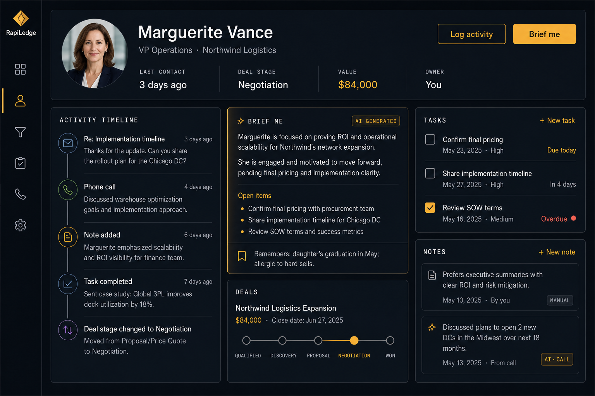
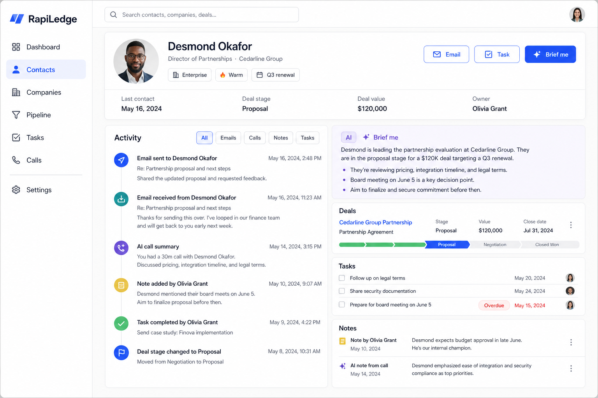
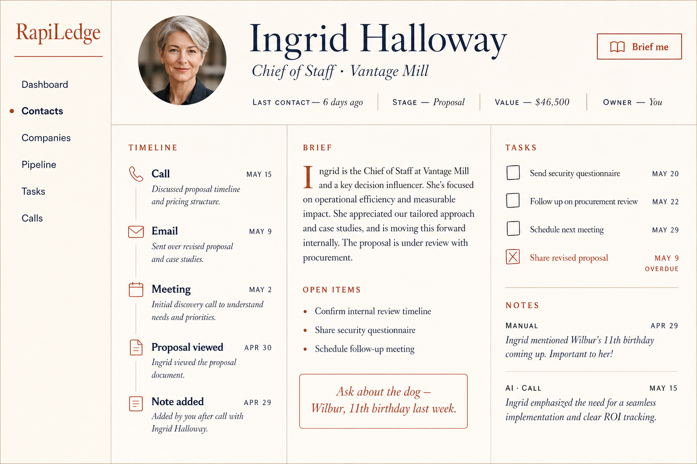
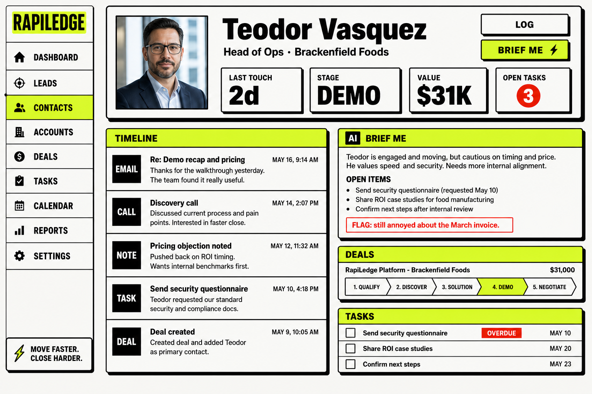
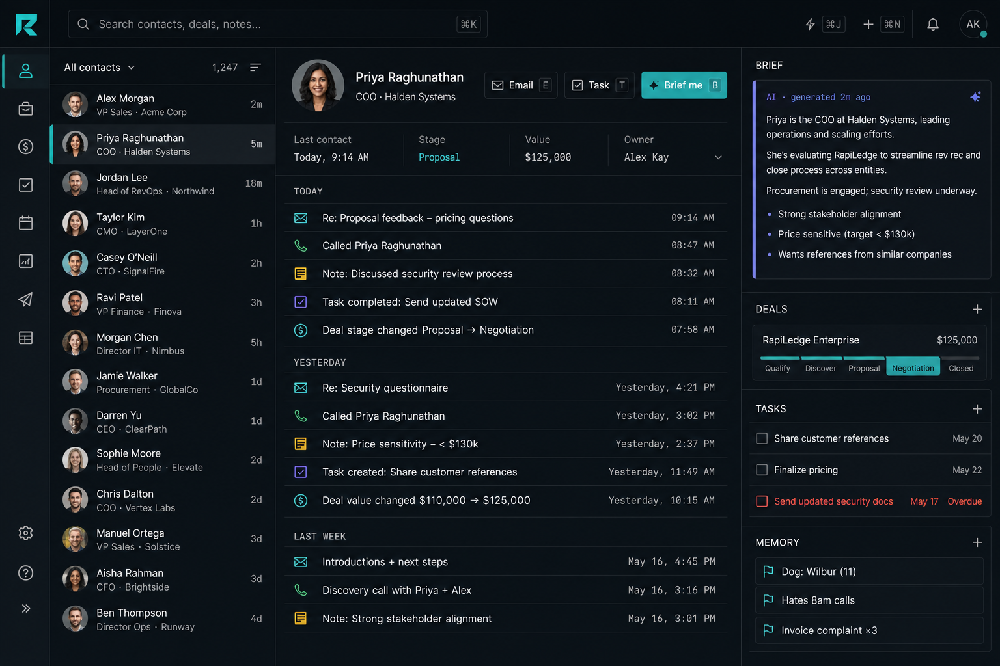
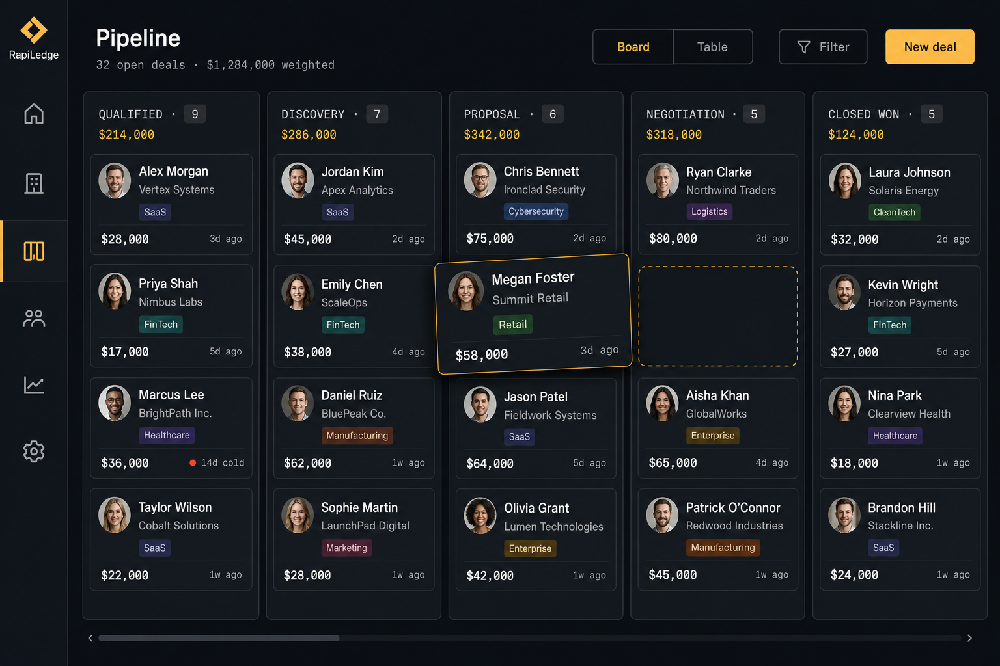
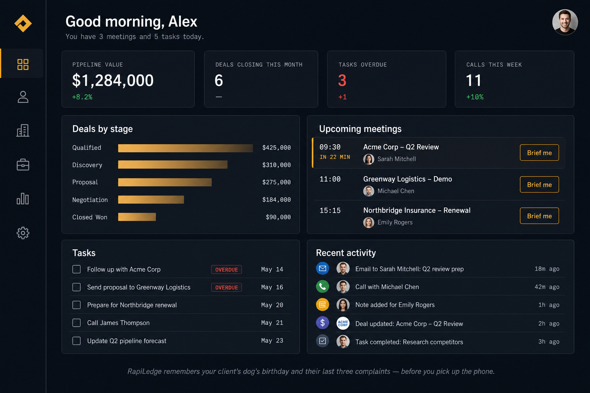
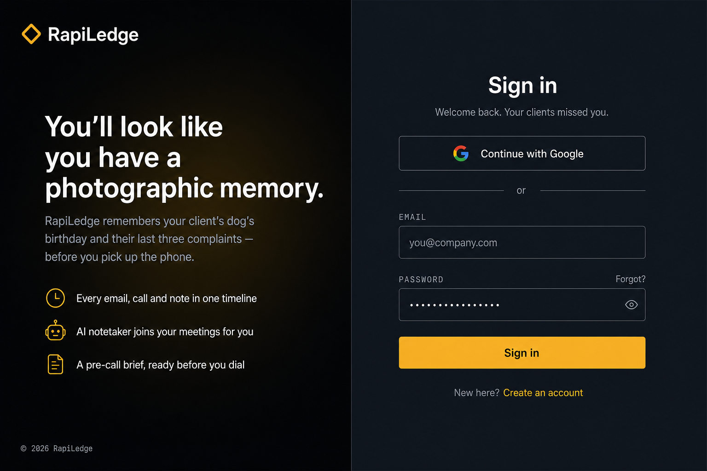

# RapiLedge — UI Design Directions

Five visual directions for the contact record page, the screen the whole product is
organised around. Each option shows the same content — header, activity timeline,
"Brief me" digest, deals, tasks, notes — so the directions can be compared on style
rather than on layout.

Pick one and the rest of the build inherits its tokens.

---

## Option 1 — Intelligence Dossier (dark)

Deep charcoal-navy surfaces, hairline borders, amber-gold used only where it earns
attention: the "Brief me" button, AI badges, deal values, the active pipeline stage.
Field labels are small uppercase monospace, which makes the record read like a briefing
document rather than a form.

- **Palette:** bg `#0E1116`, panel `#171B22`, border `#252B35`, accent `#F2B33D`
- **Fits the brand:** directly. "Confident, a little sly" reads as a dossier, not a spreadsheet.
- **Watch out for:** dark UIs need real discipline on contrast for muted secondary text.

## Option 2 — Clarity Light

The familiar, safe, HubSpot-adjacent read. Light warm-gray canvas, white cards, indigo
primary, violet reserved exclusively for AI-generated content so the manual/AI
distinction is carried by colour alone.

- **Palette:** bg `#F6F7F9`, card `#FFFFFF`, border `#E6E8EC`, accent `#3B5BFD`, AI violet
- **Fits the brand:** weakly. It is competent and instantly legible, but it looks like every other CRM.
- **Watch out for:** as a portfolio piece it demonstrates craft but not point of view.

## Option 3 — Editorial Memory

Warm cream paper, serif contact names, hairline rules instead of card shadows, and an
AI brief typeset as an editorial paragraph with a drop cap. The "ask about the dog"
detail becomes a pull-quote — the memory promise made literal in the typography.

- **Palette:** bg `#FAF6EF`, card `#FFFDF8`, border `#E4DACA`, accent `#B5502F`, ink `#26303F`
- **Fits the brand:** on the "remembers the human details" half, beautifully.
- **Watch out for:** low density. Serif + generous leading does not scale to a 40-row timeline or a kanban board, and it reads soft rather than sly.

## Option 4 — Bold Signal

Neo-brutalist: 2px black borders, hard offset shadows, lime fills, heavy grotesque type.
Loud and memorable, with red reserved for flags and overdue so urgency actually cuts through.

- **Palette:** bg `#F2F2EF`, border `#111111`, accent `#D6FF3F`, alert `#FF4B2B`
- **Fits the brand:** on "cheeky," yes. On "confident and trustworthy with client data," less so.
- **Watch out for:** high-contrast chrome competes with the content. Fatiguing for an all-day tool, and the lime is hard to use accessibly on text.

## Option 5 — Command Center

Linear/Superhuman density. Three panes, contact list always visible, 12–13px type,
monospace timestamps, keyboard hints on every action, date-grouped timeline. Adds a
**Memory** module of flagged detail chips ("Dog: Wilbur (11)", "Hates 8am calls",
"Invoice complaint ×3") — the single best expression of the core promise across all
five options.

- **Palette:** bg `#0B0D10`, panel `#14171C`, border `#22262E`, accent `#3DE0C8`, AI indigo
- **Fits the brand:** strongly, for a power user.
- **Watch out for:** the three-pane layout has to fully recompose on mobile, and dense small type is the hardest thing on this list to execute well in code.

---

## Recommendation

**Option 1 (Intelligence Dossier), with the Memory chips module borrowed from Option 5.**

Reasoning:

- It is the closest match to the positioning. Amber-on-charcoal with monospace labels
  looks like intelligence you were handed, which is exactly the "photographic memory" pitch.
- It is the most buildable of the distinctive options. Standard card grid, normal type
  sizes, one accent colour — straightforward to express as Tailwind tokens and shadcn/ui
  primitives, and it degrades to a single column on mobile without a redesign.
- It has room for the AI layer. Amber is unused elsewhere in the UI, so every amber
  element can mean "this is the thing RapiLedge knows that you don't."
- Option 5's Memory chips are the one element worth stealing outright: durable facts
  about a person, pinned separately from the chronological timeline. That is the feature
  the tagline is describing, and no other option surfaces it as a first-class object.

Three further screens in the recommended direction, to prove it holds up beyond one page:

### Pipeline

Five stages, per-column count and total, drag state shown with a dashed amber drop zone,
and a `14d cold` staleness marker on a neglected deal.

### Dashboard

KPI row, deals-by-stage bars, upcoming meetings each with an inline "Brief me" button,
overdue tasks, and a cross-contact activity feed. The positioning line sits in the footer.

### Login

Carries the brand line as the headline: "You'll look like you have a photographic memory,"
with the dog's-birthday line directly beneath it.

---

## Proposed design tokens (Option 1)

If Option 1 is approved, these become the Tailwind theme.

| Token | Value | Use |
| --- | --- | --- |
| `bg` | `#0E1116` | App canvas |
| `surface` | `#171B22` | Cards, panels |
| `surface-raised` | `#1D222B` | Hover, popovers, inputs |
| `border` | `#252B35` | Hairline dividers |
| `text` | `#F5F7FA` | Primary text |
| `text-muted` | `#8A94A6` | Secondary text, labels |
| `accent` | `#F2B33D` | AI output, primary action, active state |
| `accent-ink` | `#0E1116` | Text on amber fills |
| `danger` | `#E5533D` | Overdue, flags |
| `success` | `#3FBF87` | Positive deltas, closed-won |

Type: geometric sans for UI (Inter or Geist), monospace for labels, timestamps and
values (Geist Mono or JetBrains Mono). Field labels are 11px uppercase with 0.08em
tracking. Radius 8px on cards, 6px on controls. No gradients except the login glow.

**Semantic rule to hold to throughout the build:** amber means "machine-generated or
machine-recalled." Manual notes, user-entered fields, and human actions stay neutral.
This gives the manual/AI distinction the data model already requires (`notes.source`)
a consistent visual language, for free, on every surface.
