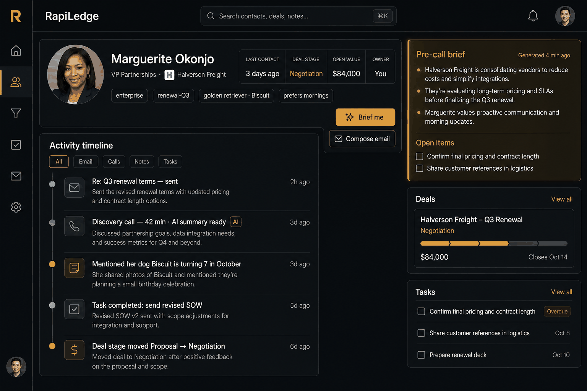
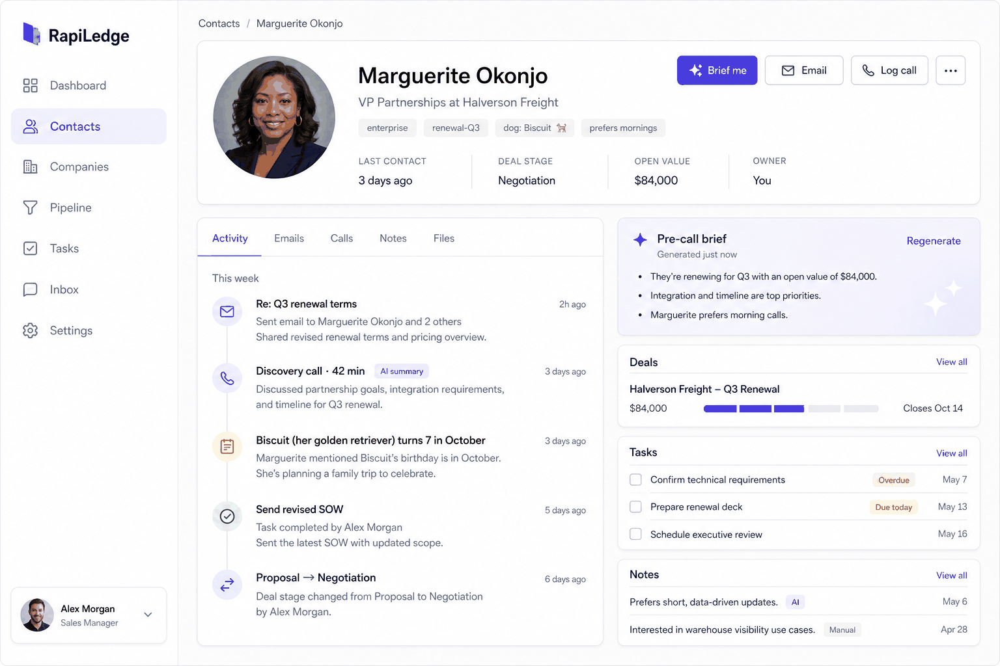
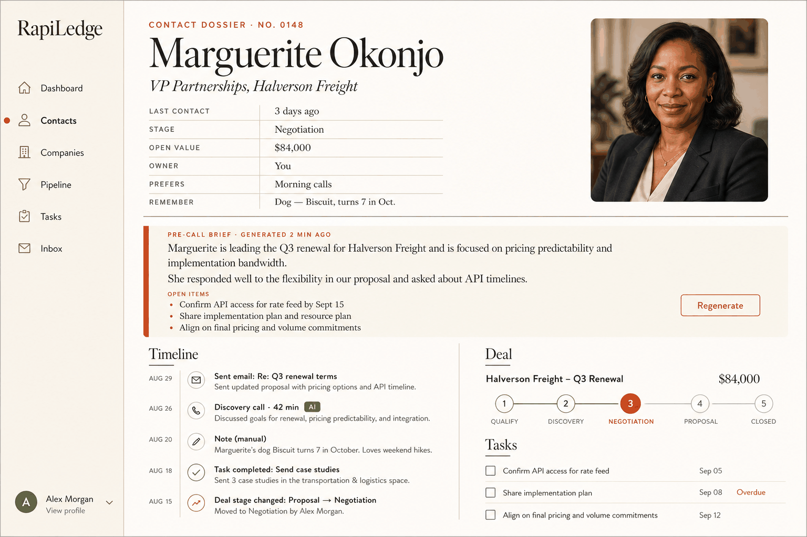
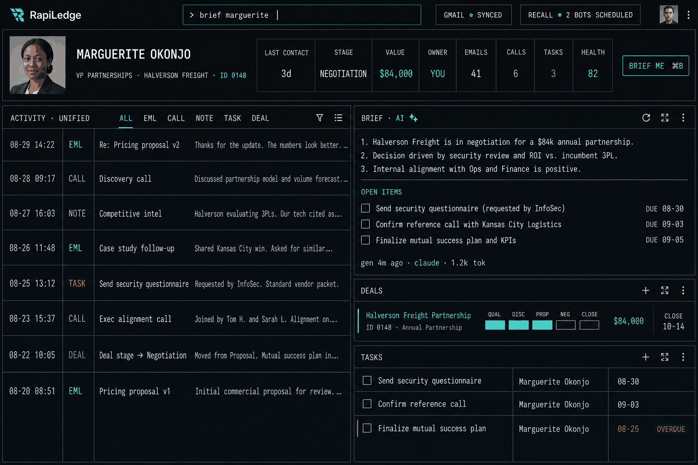
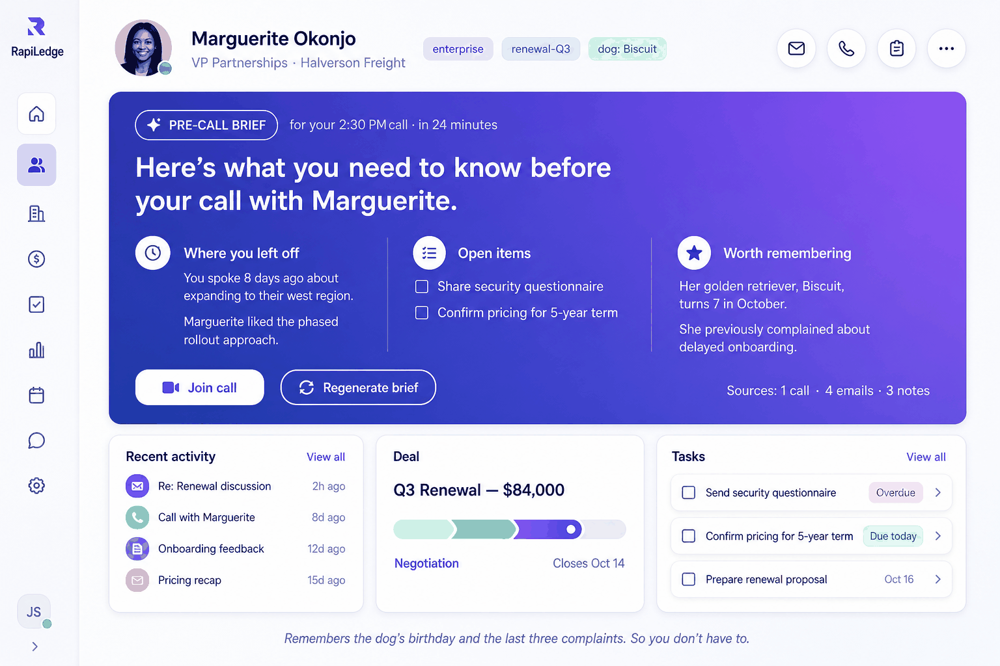

# RapiLedge — UI Design Directions

Five candidate visual directions for RapiLedge, each rendered as the **contact record page**
— the screen the whole product is organised around. Every option shows the same fictional
contact (Marguerite Okonjo, VP Partnerships at Halverson Freight) with the same underlying
content, so the only variable between them is the design language.

All five carry the positioning promise in some form: the "Brief me" pre-call digest is
present in each, and each surfaces a "worth remembering" detail (her golden retriever
Biscuit turning 7 in October) alongside a past complaint — the dog's-birthday test.

Mockups live in [`mockups/`](./mockups).

---

## Option 1 — Dossier Dark

Near-black charcoal surfaces, warm amber accent, icon-only left rail. Reads like an
intelligence briefing rather than a sales tool. The amber-tinted "Pre-call brief" panel
anchors the right column and is the only strongly saturated element on screen, so the eye
goes there first.

- **Strengths:** distinctive against a market of white-and-blue CRMs; amber-on-charcoal makes AI content unmistakable without a badge; comfortable for all-day use.
- **Trade-offs:** dark mode raises the bar on data-density polish (borders, disabled states, charts all need care); harder to make the pipeline kanban feel light.
- **Best if:** the "sly, photographic memory" tone is the priority.

## Option 2 — Clean Light SaaS

The HubSpot/Linear-adjacent baseline: white cards on light grey, indigo primary, labelled
sidebar, tabbed activity feed. Panels are separated by hairline borders rather than
shadows, and the brief card is distinguished by a soft indigo gradient wash.

- **Strengths:** lowest execution risk and fastest to build — maps almost 1:1 onto shadcn/ui defaults; instantly legible to anyone who has used a CRM; the tab strip scales cleanly as activity types are added.
- **Trade-offs:** least memorable; the brand has to come from copy and the brief feature rather than the chrome.
- **Best if:** shipping the full v1 feature set matters more than visual differentiation.

## Option 3 — Editorial Warm

Cream paper, high-contrast serif headings, terracotta accent, thin rules instead of boxes.
The contact page is literally framed as a dossier ("CONTACT DOSSIER · NO. 0148") with a
ruled field table and a pull-quote brief block spanning the full width.

- **Strengths:** the most on-message with "we keep a file on everyone"; the ruled-table field list is genuinely more scannable than card grids; strong typographic hierarchy makes the page feel considered rather than assembled.
- **Trade-offs:** serif display type and thin rules degrade fastest at small viewport sizes; a kanban board in this language needs real design work; unusual enough that new users may hesitate.
- **Best if:** this is a portfolio piece first and the goal is to be remembered.

## Option 4 — Command Center

Maximum density. A persistent command palette in the top bar (`> brief marguerite`), a
monospace metadata layer, four-letter type tags on every timeline row, and integration
status chips (`GMAIL ● SYNCED`, `RECALL ● 2 BOTS SCHEDULED`) always visible in the header.
Eight activity rows fit where other options show five.

- **Strengths:** shows the most information per screen; the header status chips solve a real problem — Gmail watch expiry and Recall bot scheduling are both silent-failure modes that deserve permanent visibility; keyboard-first suits daily power use.
- **Trade-offs:** near-hostile to new users and to mobile; the density is a promise you have to keep on every subsequent screen; monospace metadata limits how much text fits.
- **Best if:** the intended user is one person running their whole book of business through it.

## Option 5 — Brief-First

Inverts the usual CRM hierarchy. The AI brief is a full-width gradient hero taking the top
two-thirds of the page, structured as three columns — "Where you left off", "Open items",
"Worth remembering" — with the meeting countdown ("for your 2:30 PM call · in 24 minutes")
and a **Join call** button inline. Contact identity shrinks to a single compact bar;
activity, deal and tasks become three supporting cards below the fold line. The tagline
sits at the bottom of the page.

- **Strengths:** the only option where the product's whole thesis is the first thing you see; "Worth remembering" as a named, permanent column is the dog's-birthday promise made structural rather than incidental; the countdown plus Join call makes the brief feel time-critical instead of a feature you have to remember to click.
- **Trade-offs:** the hero is dead weight between calls and when there is little history to summarise — it needs a genuinely good empty/low-data state; pushes the timeline below the fold, which fights the "everything at once" brief in the spec; leans hardest on AI quality, since a weak brief is now the most prominent thing on screen.
- **Best if:** the goal is for the demo to land in the first five seconds.

---

## Recommendation

**Option 5 for the contact page's brief treatment, built on Option 2's design system.**

They are compatible rather than competing: Option 2's indigo-on-white foundation, hairline
borders and card rhythm are the same language Option 5's supporting cards already use.
Taking Option 2 as the system and Option 5's hero as the contact page's signature element
gets differentiation exactly where the product's argument is, while every other screen —
pipeline kanban, dashboard, tasks, settings — stays in conventional, low-risk territory
that maps directly onto shadcn/ui primitives.

Two things worth stealing regardless of which direction wins:

1. **Option 4's integration status chips.** Gmail `watch` subscriptions expire after seven
   days and Recall bots are scheduled ahead of meetings; both fail silently. Persistent
   header state turns an invisible outage into something you notice the same day.
2. **Option 3's ruled field table.** Better than a card grid for the long tail of custom
   fields and the "remember this" details that are the point of the product.

The hero's weak spot is the cold-start case. Mitigation: when there is not enough history
to brief on, the hero collapses to a single-line prompt in the same gradient rather than
rendering three empty columns — which is also the natural home for the positioning line.

## Open decisions

- Whether a dark theme ships in v1 or is deferred (Option 1 becomes the dark variant of whichever system wins).
- Whether the command palette from Option 4 is v1 or later — it is additive to any of these systems.
- Mobile behaviour for the contact page: the three-panel layout has to collapse to a single scrolling column, and the brief should stay pinned to the top on every option.
